# Schéma du workflow

Le flux complet, du mail d'alerte jusqu'à la notification.

```mermaid
flowchart LR
    A["📧 Gmail Trigger<br/>Alerte Emploi"] --> B["🧩 Préparer la requête<br/>(prompt + schéma JSON)"]
    B --> C["🤖 Extraction IA<br/>API Gemini"]
    C --> D["🧱 Structurer l'offre<br/>parse JSON"]
    D --> E["🧹 Déduplication<br/>liens déjà vus"]
    E --> F["🗂️ Enregistrer<br/>base Notion"]
    F --> G["🔔 Notifier<br/>e-mail récap"]

    classDef trigger fill:#1e3a5f,stroke:#4a90d9,stroke-width:2px,color:#ffffff;
    classDef ai fill:#4a2c5e,stroke:#a86fd4,stroke-width:2px,color:#ffffff;
    classDef process fill:#1f4d3d,stroke:#3fbf8f,stroke-width:2px,color:#ffffff;
    classDef store fill:#5c3a1e,stroke:#d9974a,stroke-width:2px,color:#ffffff;

    class A trigger;
    class B,D,E process;
    class C ai;
    class F store;
    class G trigger;
```

## Lecture du flux

1. **Déclencheur** — un e-mail d'alerte arrive dans la boîte Gmail (via le nœud *Gmail Trigger*, qui interroge la boîte régulièrement).
2. **Préparation** — un nœud *Code* construit le prompt et le schéma JSON attendu, à partir du sujet et du corps du mail.
3. **Extraction IA** — un appel HTTP à l'API **Google Gemini** renvoie l'offre sous forme de JSON structuré (`responseSchema` garantit le format).
4. **Structuration** — un nœud *Code* parse la réponse et normalise les champs : `intitule`, `entreprise`, `lieu`, `lien`.
5. **Déduplication** — les liens déjà traités (mémorisés dans le stockage statique du workflow) sont écartés ; seules les nouvelles offres continuent.
6. **Notion** — chaque nouvelle offre est écrite dans la base Notion.
7. **Notification** — un e-mail récapitulatif est envoyé pour chaque offre ajoutée.

> Le code couleur : bleu = déclencheur/notification, violet = IA, vert = traitement, orange = stockage.
> Texte blanc sur fonds foncés pour un contraste lisible en thème clair comme en thème sombre.
